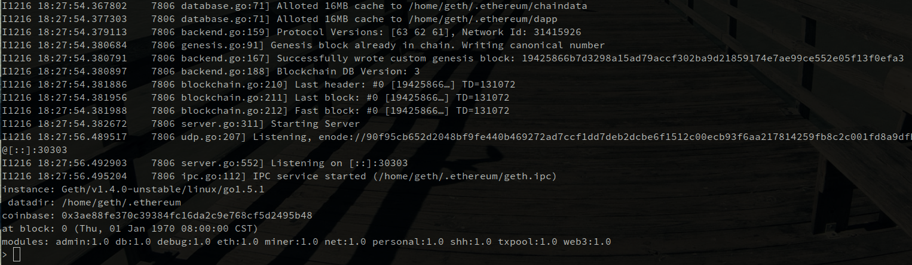

# Ethereum Bootstrap

通过本文所述方法和项目中的脚本，我们可以快速的搭建好自己的私链进行开发测试。

仓库中包含的工具有：

* 一个测试账户导入脚本，在首次部署时将五个测试账户私钥导入以太坊节点。
* 一个genesis.json配置文件，为对应的五个测试账户提供初始资金（以太币），方便开发测试。
* 一个快速启动私有链节点并进入交互模式的脚本。
* 一个合约样例：`contracts/Token.sol`。这是一个使用合约语言[Solidity](http://solidity.readthedocs.org/en/latest/)编写的智能合约。Token合约的功能是发行一种token（可以理解为货币，积分等等），只有合约的创建者有发行权，token的拥有者有使用权，并且可以自由转账。

**测试账户私钥是放在Github上的公开数据，千万不要用于正式环境中或者公有链上。如果在测试环境之外的地方使用这些私钥，你的资金将会被窃取！**

## 准备

1. 在本地安装好[go-ethereum](https://github.com/ethereum/go-ethereum)和[solc](http://solidity.readthedocs.org/en/latest/), 可以执行`geth`和`solc`命令。如果操作系统是ubuntu, 安装官方的ethereum安装包即可。
2. 将本仓库通过`git clone`命令下载到本地。
3. 安装[expect](http://expect.sourceforge.net/)，工具脚本用它来自动化一些过程。例如在ubuntu上: `sudo apt-get install expect`

## 启动geth

1. 进入本仓库目录: `cd ethereum-bootstrap`
2. 导入测试账户私钥: `./bin/import_keys.sh`
3. 初始化blockchain: `./bin/private_blockchain_init.sh`
   输出的结果类似如下, $(DIR))代表你的下载路径：
   ```
    INFO [09-25|11:07:26] Allocated cache and file handles         database=$(DIR)/ethereum-bootstrap/data/geth/chaindata cache=16 handles=16
	INFO [09-25|11:07:26] Successfully wrote genesis state         database=chaindata                                      hash=194258…f0efa3
	INFO [09-25|11:07:26] Allocated cache and file handles         database=$(DIR)/ethereum-bootstrap/data/geth/lightchaindata cache=16 handles=16
	INFO [09-25|11:07:26] Successfully wrote genesis state         database=lightchaindata                                      hash=194258…f0efa3
   ```
4. 为解决之后操作账户锁定问题，修改本目录下bin/private_blockchain.sh文件，在$geth后添加--unlock 0 --password value.
   其中0表示解锁第0个账户，value为包含你第2步设置的密码的文件的地址路径，需要你建立。这样下面就不需要再解锁账户的操作。
5. 启动私有链节点: `./bin/private_blockchain.sh`. 启动成功后可以看到类似如下输出:
  
6. 此时以太坊交互式控制台已经启动，我们可以开始测试和开发了。

注意：工具脚本假设你的geth安装在默认位置, 可以直接通过`geth`执行。如果`geth`命令安装在非标准的位置，可以设置`GETH`环境变量指定geth可执行文件的路径。例如:

`GETH=/some/weird/dir/geth ./bin/import_keys.sh`

## 通过挖矿来为account发放ether
查看账号余额：
```
> web3.eth.getBalance(web3.eth.accounts[0])
2e+30
```
可以通过挖矿的方式给第一个账号发行ether：
```
> miner.start(1)
I0822 17:17:43.496826 miner/miner.go:119] Starting mining operation (CPU=1 TOT=3)
I0822 17:17:43.497379 miner/worker.go:573] commit new work on block 30 with 0 txs & 1 uncles. Took 527.407µs
```
需要调用miner.stop来停止挖矿：
```
> miner.stop()
true
> web3.eth.getBalance(web3.eth.accounts[0])
2.000000000105e+30
```
使用账号前先解锁：
```
> personal.unlockAccount(web3.eth.accounts[0])
```

## 使用以太坊控制台编译和部署智能合约

在`contracts`目录下有一个智能合约样例文件`Token.sol`, 通过Solidity语言实现了基本的代币功能, 合约持有者可以发行代币, 使用者可以互相转账.

我们可以使用以太坊控制台来编译部署这个合约．以太坊控制台是最基本的工具，使用会比较繁琐．社区也提供了其他更加方便的部署工具，此处不做讨论．

第一步，我们先编译合约代码．新建一个ssh session, 切换到geth用户环境`su - geth`, 然后输入：``echo "var tokenCompiled=`solc --optimize --combined-json abi,bin,interface contracts/Token.sol`" > token.js``.(此步为编译合约代码，并将生成的内容放入当前路径下的token.js文件)

切换到以太坊控制台，把js文件加载进来:

```javascript
loadScript("token.js")
```

通过`tokenCompiled.contracts["contracts/Token.sol:Token"].bin`可以看到编译好的二进制代码，通过`tokenCompiled.contracts["contracts/Token.sol:Token"].abi`可以看到合约的[ABI](https://github.com/ethereum/wiki/wiki/Ethereum-Contract-ABI)．

以变量的形式取出合约的二进制代码和ABI。
```javascript
var tokenContractsBin = "0x" + tokenCompiled.contracts["contracts/Token.sol:Token"].bin;
var tokenContractsAbi = tokenCompiled.contracts["contracts/Token.sol:Token"].abi;
```

接下来我们要把编译好的合约部署到网络上去．

首先我们用ABI来创建一个javascript环境中的合约对象：

```javascript
var contract = web3.eth.contract(JSON.parse(tokenContractsAbi));
```

我们通过合约对象来部署合约：

```javascript
var initializer = {from: web3.eth.accounts[0], data: tokenContractsBin, gas: 300000};

var token = contract.new(initializer);
```

`contract.new`方法的第一个参数设置了这个新合约的创建者地址`from`, 这个新合约的代码`data`, 和用于创建新合约的费用`gas`．`gas`是一个估计值，只要比所需要的gas多就可以，合约创建完成后剩下的gas会退还给合约创建者．

`contract.new`方法的第二个参数设置了一个回调函数，可以告诉我们部署是否成功．

`contract.new`执行时会提示输入钱包密码．执行成功后，我们的合约Token就已经广播到网络上了．此时只要等待矿工把我们的合约打包保存到以太坊区块链上，部署就完成了．

在公有链上，矿工打包平均需要15秒，在私有链上，我们需要自己来做这件事情．首先开启挖矿：

```javascript
miner.start(1)
```

此时需要等待一段时间，以太坊节点会生成挖矿必须的数据，这些数据都会放到内存里面．在数据生成好之后，挖矿就会开始，稍后就能在控制台输出中看到类似：

```
:hammer:mined potential block
```

的信息，这说明挖到了一个块，合约已经部署到以太坊网络上了！此时我们可以把挖矿关闭：

```javascript
miner.stop()
```

接下来我们就可以调用合约了．先通过`token.address`获得合约部署到的地址, 以后新建合约对象时可以使用．这里我们直接使用原来的contract对象：

```
// 本地钱包的第一个地址所持有的token数量
> web3.eth.getBalance(web3.eth.accounts[0])
0

// 发行100个token给本地钱包的第一个地址
> token.issue.sendTransaction(web3.eth.accounts[0], 100, {from: web3.eth.accounts[0]});
I1221 11:48:30.512296   11155 xeth.go:1055] Tx(0xc0712460a826bfea67d58a30f584e4bebdbb6138e7e6bc1dbd6880d2fce3a8ef) to: 0x37dc85ae239ec39556ae7cc35a129698152afe3c
"0xc0712460a826bfea67d58a30f584e4bebdbb6138e7e6bc1dbd6880d2fce3a8ef"

// 发行token是一个transaction, 因此需要挖矿使之生效
> miner.start(1)
:hammer:mined potential block
> miner.stop()

// 再次查询本地钱包第一个地址的token数量
> token.getBalance(web3.eth.accounts[0])
100

// 从第一个地址转30个token给本地钱包的第二个地址
> token.transfer.sendTransaction(web3.eth.accounts[1], 30, {from: web3.eth.accounts[0]})
I1221 11:53:31.852541   11155 xeth.go:1055] Tx(0x1d209cef921dea5592d8604ac0da680348987b131235943e372f8df35fd43d1b) to: 0x37dc85ae239ec39556ae7cc35a129698152afe3c
"0x1d209cef921dea5592d8604ac0da680348987b131235943e372f8df35fd43d1b"
> miner.start(1)
:hammer:mined potential block
> miner.stop()
> token.getBalance(web3.eth.accounts[0])
70
> token.getBalance(web3.eth.accounts[1])
30
```

## 其他

私有链的所有数据都会放在仓库根目录下的`data`目录中，删除这个目录可以清除所有数据，重新启动新环境。
[solidity_compiler_helper](https://github.com/rakeshbs/solidity_compiler_helper)，可以使用这个小工具来部署，更方便。


获取关于以太坊的更多信息请访问[EthFans](http://ethfans.org).
